# AppUpdate

## 简介
> AppUpdate是基于ArkTS封装的HarmonyOS通用、功能全面的版本升级组件（也可做为自定义弹窗使用）。目前只支持配置弹窗样式以及跳转到华为应用市场，后续会配合使用华为应用市场提供的升级SDK进行版本校验。
> 


## 示例截图
|                                 简单调用方法                                 |                                  强制升级                                  |                                    有副标题                                     |
|:----------------------------------------------------------------------:|:----------------------------------------------------------------------:|:---------------------------------------------------------------------------:|
| 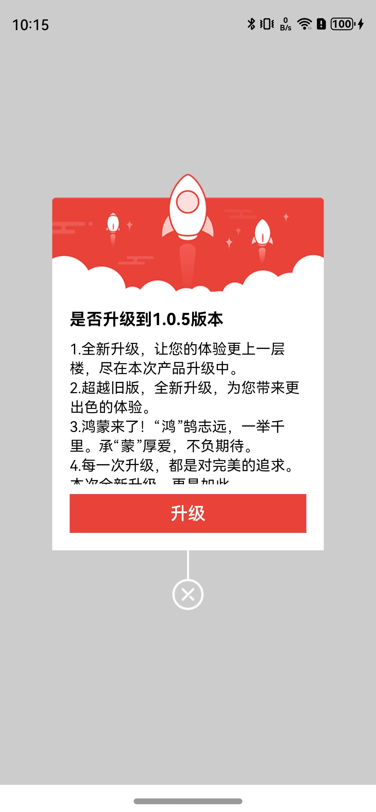  | 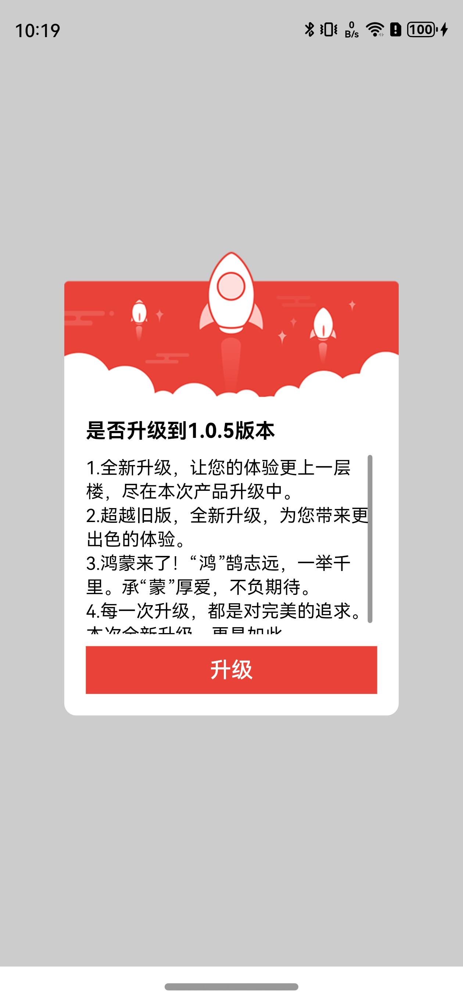  |      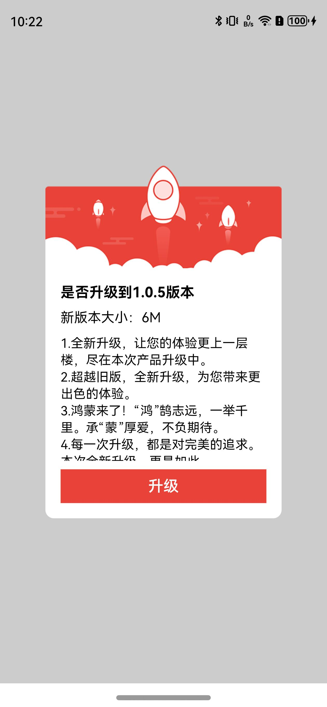       |
|                              点击取消、升级按钮回调                               |                                设置文本大小颜色                                |                                  设置文本最大高度                                   |
|   | 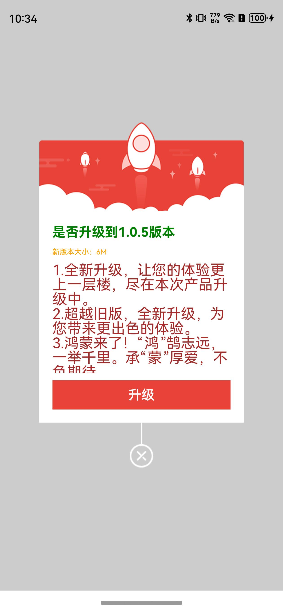  |      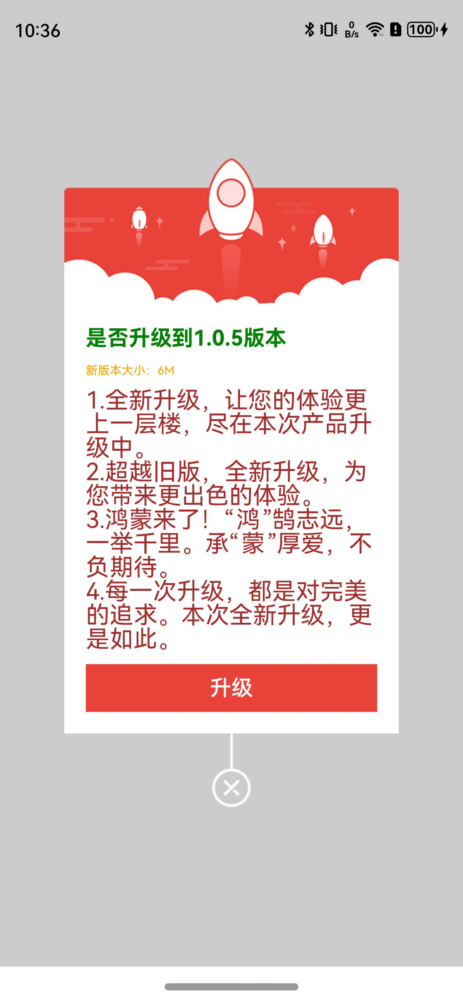       |
|                              样式：STYLE_RED                              |                             样式：STYLE_BLUE                              |                               样式：STYLE_DRAGON                               |
| 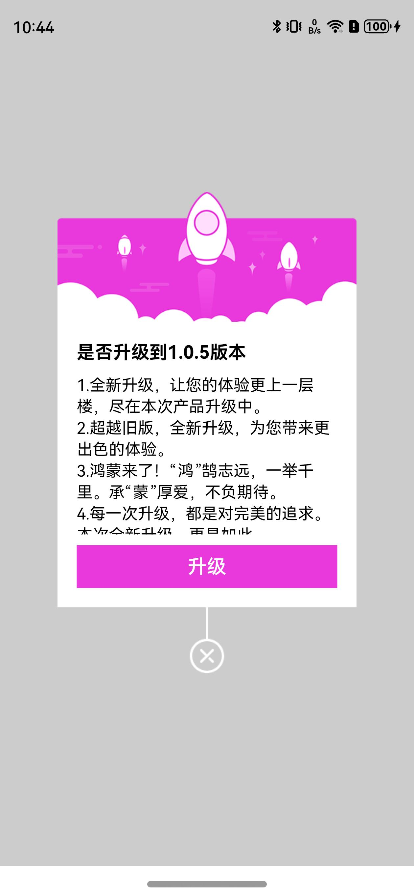  | 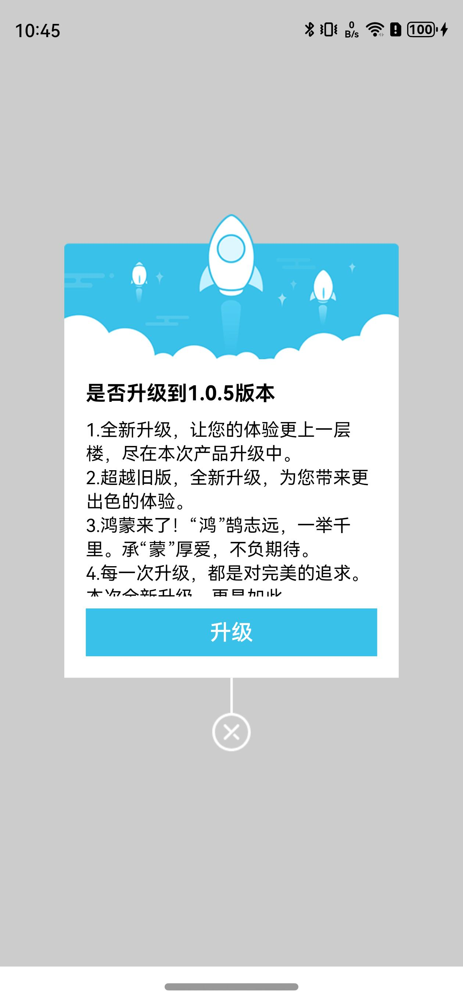  |      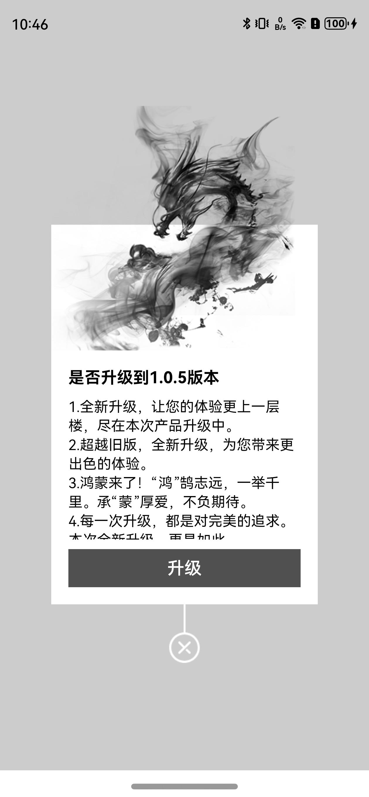       |
|                             样式：STYLE_LAMP                              |                            样式：STYLE_CANVAS                             |                                    自定义样式                                     |
| 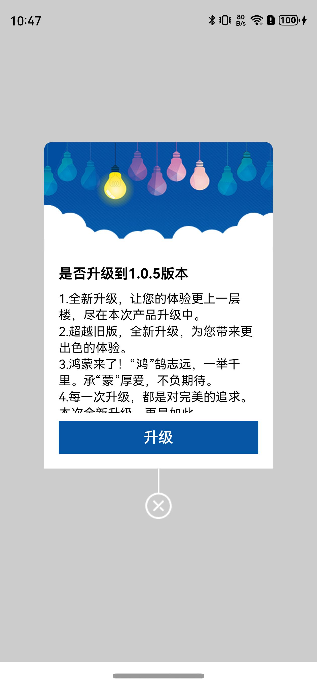 | 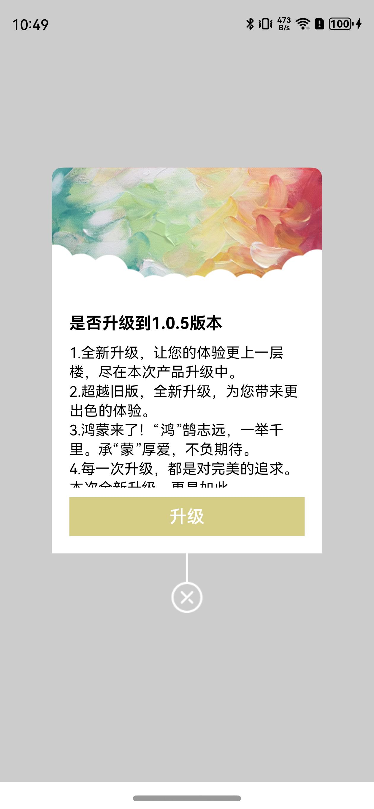 |      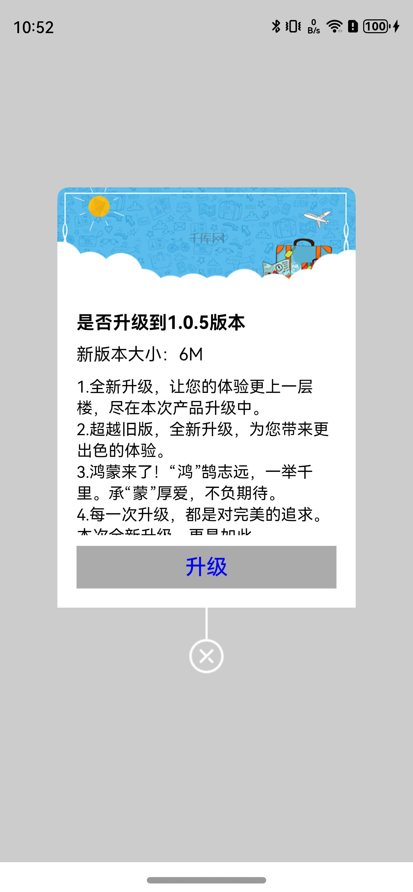       |
|                                自定义布局组件                                 |                                自定布局提示弹窗                                |                                    自定布局输入弹窗                                     |
| 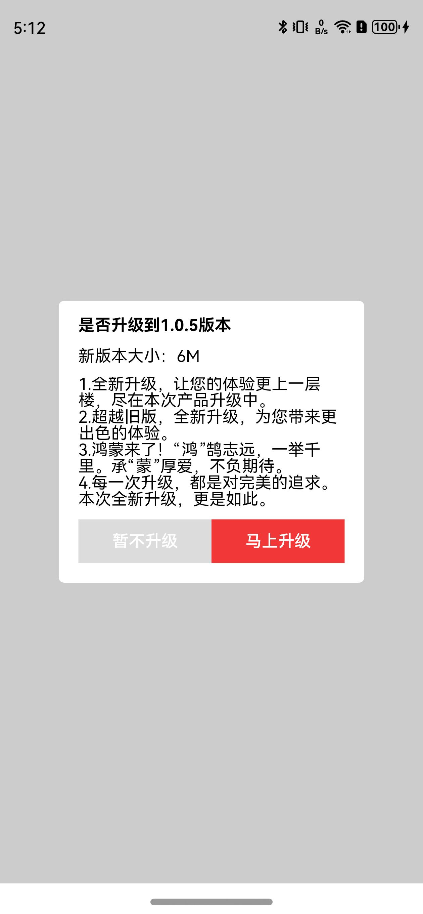 | 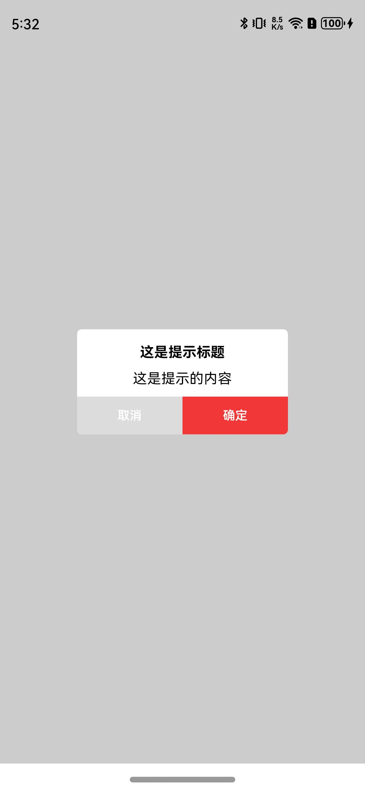 |      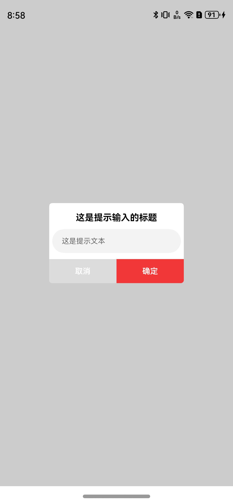       |
## 下载安装
```shell
ohpm install @smarthane/appupdate  
```

## 使用说明
1. 引入文件及代码依赖
 ```
    import { AppUpdateDialogModel, AppUpdateHelper, DialogStyleEnum } from '@smarthane/appupdate'
 ```
2. 使用步骤说明
 ```
AppUpdateHelper.showDialog({
    // 升级标题栏
    title: this.mDefaultTitle,
    // 副标题
    subTitle: this.mDefaultSubTitle,
    // 升级文案内容
    content: this.mDefaultUpdateContent,
    // 是否强制升级
    isForce: false,
    // 跳转到华为应用市场的包名，此处测试为华为视频的包名
    bundleName: 'com.huawei.hmsapp.himovie',
    // 点击取消按钮回调
    cancel: () => {
      promptAction.showToast({
        message: "点击了取消按钮",
        duration: 2000
      })
    },
    // 点击升级按钮回调
    confirm: () => {
      promptAction.showToast({
        message: "点击了升级按钮",
        duration: 2000
      })
    },
    // 设置文本内容大小和颜色
    titleFontSize: '18fp',
    titleFontColor: Color.Green,
    subTitleFontSize: '10fp',
    subTitleFontColor: Color.Orange,
    contentFontSize: '20fp',
    contentFontColor: Color.Brown,
    // 设置文本最大高度
    contentMaxHeight: '300vp'
})

/**************************高级组件用法：自定义布局组件**************************/
AppUpdateHelper.showDialog({
    dialogStyleEnum: DialogStyleEnum.STYLE_CUSTOM_ALL,
    customView: () => {
      this.builderCustomUpdateView();
    }
})
AppUpdateHelper.showDialog({
    dialogStyleEnum: DialogStyleEnum.STYLE_CUSTOM_ALL,
    customView: () => {
      this.builderCustomDialogTipView();
    }
})
AppUpdateHelper.showDialog({
    dialogStyleEnum: DialogStyleEnum.STYLE_CUSTOM_ALL,
    customView: () => {
      this.builderCustomDialogInputView();
    }
})
/****************************************************************************/

 ```
3. 使用示例

【详细可以参考[工程entry模块下面的示例代码](https://gitee.com/smarthane/appupdate/blob/master/entry/src/main/ets/pages/Index.ets)】

 ```
import { AppUpdateDialogModel, AppUpdateHelper, DialogStyleEnum } from '@smarthane/appupdate'
import promptAction from '@ohos.promptAction'
import { TitleBar } from '@smarthane/titlebar'
import { common } from '@kit.AbilityKit'

const uiContext = getContext(this) as common.UIAbilityContext

@Entry
@Component
struct Index {
  private mDefaultTitle: string = "是否升级到1.0.5版本";
  private mDefaultSubTitle: string = "新版本大小：6M";
  private mDefaultUpdateContent: string = "1.全新升级，让您的体验更上一层楼，尽在本次产品升级中。\n2.超越旧版，全新升级，为您带来更出色的体验。\n3.鸿蒙来了！“鸿”鹄志远，一举千里。承“蒙”厚爱，不负期待。\n4.每一次升级，都是对完美的追求。本次全新升级，更是如此。";
  private mModelList: Array<DialogItem> = [
    {
      /**************************简单调用方法**************************/
      // 升级弹窗模型
      model: {
        // 升级标题栏
        title: this.mDefaultTitle,
        // 升级文案内容
        content: this.mDefaultUpdateContent,
        // 是否强制升级
        isForce: false,
        // 跳转到华为应用市场的包名，此处测试为华为视频的包名
        bundleName: 'com.huawei.hmsapp.himovie'
      },
      /***************************************************************/
      image: $r('app.media.ic_screenshot_2'),
      desc: '简单调用方法'
    },
    {
      /***************************强制升级*************************/
      // 升级弹窗模型
      model: {
        // 升级标题栏
        title: this.mDefaultTitle,
        // 升级文案内容
        content: this.mDefaultUpdateContent,
        // 是否强制升级
        isForce: true,
        // 跳转到华为应用市场的包名，此处测试为华为视频的包名
        bundleName: 'com.huawei.hmsapp.himovie'
      },
      /**********************************************************/
      image: $r('app.media.ic_screenshot_1'),
      desc: '强制升级'
    },
    {
      /***************************有副标题*************************/
      // 升级弹窗模型
      model: {
        // 升级标题栏
        title: this.mDefaultTitle,
        // 副标题
        subTitle: this.mDefaultSubTitle,
        // 升级文案内容
        content: this.mDefaultUpdateContent,
        // 是否强制升级
        isForce: true,
        // 跳转到华为应用市场的包名，此处测试为华为视频的包名
        bundleName: 'com.huawei.hmsapp.himovie'
      },
      /**********************************************************/
      image: $r('app.media.ic_screenshot_3'),
      desc: '有副标题'
    },
    {
      /***************************点击取消、升级按钮回调*************************/
      // 升级弹窗模型
      model: {
        // 升级标题栏
        title: this.mDefaultTitle,
        // 副标题
        subTitle: this.mDefaultSubTitle,
        // 升级文案内容
        content: this.mDefaultUpdateContent,
        // 是否强制升级
        isForce: false,
        // 跳转到华为应用市场的包名，此处测试为华为视频的包名
        bundleName: 'com.huawei.hmsapp.himovie',
        // 点击取消按钮回调
        cancel: () => {
          promptAction.showToast({
            message: "点击了取消按钮",
            duration: 2000
          })
        },
        // 点击升级按钮回调
        confirm: () => {
          promptAction.showToast({
            message: "点击了升级按钮",
            duration: 2000
          })
        }
      },
      /**********************************************************/
      image: $r('app.media.ic_screenshot_1'),
      desc: '取消升级回调方法'
    },
    {
      /***************************设置文本大小颜色*************************/
      // 升级弹窗模型
      model: {
        // 升级标题栏
        title: this.mDefaultTitle,
        // 副标题
        subTitle: this.mDefaultSubTitle,
        // 升级文案内容
        content: this.mDefaultUpdateContent,
        // 是否强制升级
        isForce: false,
        // 跳转到华为应用市场的包名，此处测试为华为视频的包名
        bundleName: 'com.huawei.hmsapp.himovie',
        // 点击取消按钮回调
        cancel: () => {
          promptAction.showToast({
            message: "点击了取消按钮",
            duration: 2000
          })
        },
        // 点击升级按钮回调
        confirm: () => {
          promptAction.showToast({
            message: "点击了升级按钮",
            duration: 2000
          })
        },
        // 设置文本内容大小和颜色
        titleFontSize: '18fp',
        titleFontColor: Color.Green,
        subTitleFontSize: '10fp',
        subTitleFontColor: Color.Orange,
        contentFontSize: '20fp',
        contentFontColor: Color.Brown,
        // 替换升级按钮文字内容
        confirmName: '立即升级'
      },
      /**********************************************************/
      image: $r('app.media.ic_screenshot_5'),
      desc: '设置文本大小颜色'
    },
    {
      /***************************设置文本最大高度*************************/
      // 升级弹窗模型
      model: {
        // 升级标题栏
        title: this.mDefaultTitle,
        // 副标题
        subTitle: this.mDefaultSubTitle,
        // 升级文案内容
        content: this.mDefaultUpdateContent,
        // 是否强制升级
        isForce: false,
        // 跳转到华为应用市场的包名，此处测试为华为视频的包名
        bundleName: 'com.huawei.hmsapp.himovie',
        // 点击取消按钮回调
        cancel: () => {
          promptAction.showToast({
            message: "点击了取消按钮",
            duration: 2000
          })
        },
        // 点击升级按钮回调
        confirm: () => {
          promptAction.showToast({
            message: "点击了升级按钮",
            duration: 2000
          })
        },
        // 设置文本内容大小和颜色
        titleFontSize: '18fp',
        titleFontColor: Color.Green,
        subTitleFontSize: '10fp',
        subTitleFontColor: Color.Orange,
        contentFontSize: '20fp',
        contentFontColor: Color.Brown,
        // 设置文本最大高度
        contentMaxHeight: '300vp'
      },
      /**********************************************************/
      image: $r('app.media.ic_screenshot_6'),
      desc: '设置文本最大高度'
    },
    {
      /**************************样式：STYLE_RED**************************/
      // 升级弹窗模型
      model: {
        // 升级标题栏
        title: this.mDefaultTitle,
        // 升级文案内容
        content: this.mDefaultUpdateContent,
        // 是否强制升级
        isForce: false,
        // 跳转到华为应用市场的包名，此处测试为华为视频的包名
        bundleName: 'com.huawei.hmsapp.himovie',
        dialogStyleEnum: DialogStyleEnum.STYLE_RED,
      },
      /***************************************************************/
      image: $r('app.media.ic_screenshot_8'),
      desc: '样式:STYLE_RED'
    },
    {
      /**************************样式：STYLE_BLUE**************************/
      // 升级弹窗模型
      model: {
        // 升级标题栏
        title: this.mDefaultTitle,
        // 升级文案内容
        content: this.mDefaultUpdateContent,
        // 是否强制升级
        isForce: false,
        // 跳转到华为应用市场的包名，此处测试为华为视频的包名
        bundleName: 'com.huawei.hmsapp.himovie',
        dialogStyleEnum: DialogStyleEnum.STYLE_BLUE,
      },
      /***************************************************************/
      image: $r('app.media.ic_screenshot_9'),
      desc: '样式:STYLE_BLUE'
    },
    {
      /**************************样式：STYLE_DRAGON**************************/
      // 升级弹窗模型
      model: {
        // 升级标题栏
        title: this.mDefaultTitle,
        // 升级文案内容
        content: this.mDefaultUpdateContent,
        // 是否强制升级
        isForce: false,
        // 跳转到华为应用市场的包名，此处测试为华为视频的包名
        bundleName: 'com.huawei.hmsapp.himovie',
        dialogStyleEnum: DialogStyleEnum.STYLE_DRAGON,
      },
      /***************************************************************/
      image: $r('app.media.ic_screenshot_10'),
      desc: '样式:STYLE_DRAGON'
    },
    {
      /**************************样式：STYLE_LAMP**************************/
      // 升级弹窗模型
      model: {
        // 升级标题栏
        title: this.mDefaultTitle,
        // 升级文案内容
        content: this.mDefaultUpdateContent,
        // 是否强制升级
        isForce: false,
        // 跳转到华为应用市场的包名，此处测试为华为视频的包名
        bundleName: 'com.huawei.hmsapp.himovie',
        dialogStyleEnum: DialogStyleEnum.STYLE_LAMP,
      },
      /***************************************************************/
      image: $r('app.media.ic_screenshot_11'),
      desc: '样式:STYLE_LAMP'
    },
    {
      /**************************样式：STYLE_CANVAS**************************/
      // 升级弹窗模型
      model: {
        // 升级标题栏
        title: this.mDefaultTitle,
        // 升级文案内容
        content: this.mDefaultUpdateContent,
        // 是否强制升级
        isForce: false,
        // 跳转到华为应用市场的包名，此处测试为华为视频的包名
        bundleName: 'com.huawei.hmsapp.himovie',
        dialogStyleEnum: DialogStyleEnum.STYLE_CANVAS,
      },
      /***************************************************************/
      image: $r('app.media.ic_screenshot_12'),
      desc: '样式:STYLE_CANVAS'
    },
    {
      /**************************自定义样式**************************/
      // 升级弹窗模型
      model: {
        // 升级标题栏
        title: this.mDefaultTitle,
        // 副标题
        subTitle: this.mDefaultSubTitle,
        // 升级文案内容
        content: this.mDefaultUpdateContent,
        // 是否强制升级
        isForce: false,
        // 跳转到华为应用市场的包名，此处测试为华为视频的包名
        bundleName: 'com.huawei.hmsapp.himovie',
        dialogStyleEnum: DialogStyleEnum.STYLE_CUSTOM_NORMAL,
        customDialogStyle: {
          topBackgroundImage: $r("app.media.ic_update_app_top_bg_custom"),
          confirmBackgroundColor: '#ABABAB',
          confirmFontColor: Color.Blue,
          confirmFontSize: '20vp'
        }
      },
      /***************************************************************/
      image: $r('app.media.ic_screenshot_13'),
      desc: '自定义样式'
    },
    {
      /**************************自定义布局组件**************************/
      // 升级弹窗模型
      model: {
        dialogStyleEnum: DialogStyleEnum.STYLE_CUSTOM_ALL,
        customView: () => {
          this.builderCustomUpdateView();
        }
      },
      /***************************************************************/
      image: $r('app.media.ic_screenshot_14'),
      desc: '自定义布局组件'
    },
    {
      /**************************自定布局提示弹窗**************************/
      model: {
        dialogStyleEnum: DialogStyleEnum.STYLE_CUSTOM_ALL,
        customView: () => {
          this.builderCustomDialogTipView();
        }
      },
      /***************************************************************/
      image: $r('app.media.ic_screenshot_15'),
      desc: '自定布局提示弹窗'
    },
    {
      /**************************自定布局输入弹窗**************************/
      model: {
        dialogStyleEnum: DialogStyleEnum.STYLE_CUSTOM_ALL,
        customView: () => {
          this.builderCustomDialogInputView();
        }
      },
      /***************************************************************/
      image: $r('app.media.ic_screenshot_15'),
      desc: '自定布局输入弹窗'
    }
  ];
  @State mTitleModel: TitleBar.Model = new TitleBar.Model()
    .setOnLeftClickListener(async () => {
      let a = await AppUpdateHelper.getVersionName();
      let b = await AppUpdateHelper.getVersionCode();
      promptAction.showToast({
        message: `点击了左边返回按钮${a}-${b}`,
        duration: 2000
      })
    })
    .setTitleName("应用版本升级弹窗")

  /**
   * 自定布局版本升级页面
   */
  @Builder
  builderCustomUpdateView() {
    Column() {
      Column({ space: '10vp' }) {
        Text(this.mDefaultTitle)
          .fontSize('15fp')
          .fontColor(Color.Black)
          .textAlign(TextAlign.Start)
          .fontWeight(FontWeight.Bold)

        Text(this.mDefaultSubTitle)
          .fontSize('15fp')
          .fontColor(Color.Black)
          .textAlign(TextAlign.Start)
          .fontWeight(FontWeight.Regular)

        Column() {
          Scroll() {
            Flex() {
              Text(this.mDefaultUpdateContent)
                .fontSize('15fp')
                .fontColor(Color.Black)
                .textAlign(TextAlign.Start)
                .lineHeight('15vp')
            }.width("100%")
          }.scrollBar(BarState.Auto)
        }
        .width("100%")
        .constraintSize({
          maxHeight: '260vp'
        })

        Row() {
          Button('暂不升级', { type: ButtonType.Normal, stateEffect: true })
            .fontColor(Color.White)
            .fontSize('15fp')
            .backgroundColor('#dcdcdc')
            .width('50%')
            .onClick(() => {
              AppUpdateHelper.hideDialog();
            })
          Button('马上升级', { type: ButtonType.Normal, stateEffect: true })
            .fontColor(Color.White)
            .fontSize('15fp')
            .backgroundColor('#fff13737')
            .width('50%')
            .onClick(() => {
              AppUpdateHelper.jumpToStore(uiContext, 'com.huawei.hmsapp.himovie')
              AppUpdateHelper.hideDialog();
            })
        }
        .justifyContent(FlexAlign.SpaceBetween)
        .width("100%")
      }
      .alignItems(HorizontalAlign.Start)
      .width('100%')
      .padding('18vp')
      .backgroundColor(Color.White)
      .margin({
        top: -5
      })
      .borderRadius('5vp')
    }
    .width('100%')
    .backgroundColor(Color.White)
  }

  /**
   * 自定布局提示弹窗
   */
  @Builder
  builderCustomDialogTipView() {
    Column() {
      Column({ space: '10vp' }) {
        Text('这是提示标题')
          .fontSize('15fp')
          .fontColor(Color.Black)
          .textAlign(TextAlign.Start)
          .fontWeight(FontWeight.Bold)

        Text('这是提示的内容')
          .fontSize('15fp')
          .fontColor(Color.Black)
          .textAlign(TextAlign.Start)
          .fontWeight(FontWeight.Regular)

        Row() {
          Button('取消', { type: ButtonType.Normal, stateEffect: true })
            .fontColor(Color.White)
            .fontSize('13fp')
            .width('50%')
            .backgroundColor('#dcdcdc')
            .onClick(() => {
              AppUpdateHelper.hideDialog();
            })
            .borderRadius({
              bottomLeft: '5vp',
            })
          Button('确定', { type: ButtonType.Normal, stateEffect: true })
            .fontColor(Color.White)
            .fontSize('13fp')
            .width('50%')
            .backgroundColor('#fff13737')
            .onClick(() => {
              AppUpdateHelper.hideDialog();
            })
            .borderRadius({
              bottomRight: '5vp'
            })
        }
        .justifyContent(FlexAlign.SpaceBetween)
        .width("100%")
        .borderRadius({
          bottomLeft: '5vp',
          bottomRight: '5vp'
        })
      }
      .alignItems(HorizontalAlign.Center)
      .width('100%')
      .backgroundColor(Color.White)
      .borderRadius('5vp')
      .margin({
        top: '15vp'
      })
    }
    .width('80%')
    .borderRadius('5vp')
    .backgroundColor(Color.White)
  }

  /**
   * 自定布局输入弹窗
   */
  @Builder
  builderCustomDialogInputView() {
    Column() {
      Column({ space: '10vp' }) {
        Text('这是提示输入的标题')
          .fontSize('15fp')
          .fontColor(Color.Black)
          .textAlign(TextAlign.Start)
          .fontWeight(FontWeight.Bold)

        TextInput({ placeholder: '这是提示文本' })
          .fontSize('12fp')
          .fontColor(Color.Black)
          .textAlign(TextAlign.Start)
          .fontWeight(FontWeight.Regular)
          .placeholderFont({
            size: '12fp'
          })
          .height('40vp')
          .margin({
            left: '5vp',
            right: '5vp'
          })
          .onChange((value: string) => {
            console.info(value);
          })
          .onFocus(() => {
            console.info('获取焦点');
          })

        Row() {
          Button('取消', { type: ButtonType.Normal, stateEffect: true })
            .fontColor(Color.White)
            .fontSize('13fp')
            .width('50%')
            .backgroundColor('#dcdcdc')
            .onClick(() => {
              AppUpdateHelper.hideDialog();
            })
            .borderRadius({
              bottomLeft: '5vp',
            })
          Button('确定', { type: ButtonType.Normal, stateEffect: true })
            .fontColor(Color.White)
            .fontSize('13fp')
            .width('50%')
            .backgroundColor('#fff13737')
            .onClick(() => {
              AppUpdateHelper.hideDialog();
            })
            .borderRadius({
              bottomRight: '5vp'
            })
        }
        .justifyContent(FlexAlign.SpaceBetween)
        .width("100%")
        .borderRadius({
          bottomLeft: '5vp',
          bottomRight: '5vp'
        })
      }
      .alignItems(HorizontalAlign.Center)
      .width('100%')
      .backgroundColor(Color.White)
      .borderRadius('5vp')
      .margin({
        top: '15vp'
      })
    }
    .width('80%')
    .borderRadius('5vp')
    .backgroundColor(Color.White)
  }

  build() {
    Column() {
      TitleBar({ model: this.mTitleModel })
      List({ space: 12 }) {
        ForEach(this.mModelList, (item: DialogItem) => {
          ListItem() {
            Column({ space: 6 }) {
              Image(item.image)
                .objectFit(ImageFit.Fill)
                .height(260)
                .borderRadius({
                  topLeft: 5,
                  topRight: 5
                })
              Text(item.desc)
                .fontSize('10fp')
                .fontWeight(FontWeight.Bold)
                .fontColor(Color.Black)
            }
            .backgroundColor('#CCCCCC')
            .borderRadius(5)
            .padding({
              bottom: 5
            })
            .margin(5)
          }
          .onClick(() => {
            AppUpdateHelper.showDialog(item.model!!)
          })
        })
      }
      .lanes(3)
      .layoutWeight(1)
      .margin({
        left: 15,
      })
      .scrollBar(BarState.Off)
      .height('100%')
    }
    .height('100%')
  }
}

class DialogItem {
  model?: AppUpdateDialogModel;
  image?: ResourceStr;
  desc?: string;
}

 ```

## 接口说明

【详细可以参看[AppUpdateModel.ets](https://gitee.com/smarthane/appupdate/blob/master/library/src/main/ets/components/AppUpdateModel.ets)文件描述】

````

一、AppUpdateDialogModel
/**
 * 弹窗 Model
 */
export class AppUpdateDialogModel {
  // 标题
  title?: string | Resource = '';
  // 副标题
  subTitle?: string;
  // 升级内容
  content?: string | Resource = '';
  // 是否强制升级
  isForce?: boolean = false;
  // 跳转到应用市场的包名
  bundleName?: string = '';
  // 取消按钮回调
  cancel?: () => void;
  // 升级按钮回调
  confirm?: () => void;
  // 自定义View
  customView?: () => void;
  // 升级按钮名称
  confirmName?: string | Resource;
  // Dialog 样式
  dialogStyleEnum?: DialogStyleEnum;
  // 自定义样式
  customDialogStyle?: AppUpdateDialogStyleModel;
  // Dialog 位置
  alignment?: DialogAlignment;
  // 点击遮罩层是否关闭弹窗
  autoCancel?: boolean;
  // 是否显示文本内容过多时滚动条
  showScrollBar?: boolean;
  // 升级内容最大高度
  contentMaxHeight?: Length;
  // 升级内容每行高度
  contentLineHeight?: Length;
  // 升级内容文字大小
  contentFontSize?: Length;
  // 升级内容文字颜色
  contentFontColor?: ResourceColor;
  // 标题文字大小
  titleFontSize?: Length;
  // 标题文字颜色
  titleFontColor?: ResourceColor;
  // 副标题文字大小
  subTitleFontSize?: Length;
  // 副标题文字颜色
  subTitleFontColor?: ResourceColor;
}

二、AppUpdateHelper
//显示升级弹窗
AppUpdateHelper.showDialog(mModel: AppUpdateDialogModel)
//隐藏升级弹窗
AppUpdateHelper.hideDialog()

//跳转到应用市场
//@param uiContext
//@param mBundleName 应用包名
AppUpdateHelper.jumpToStore(uiContext: common.UIAbilityContext, mBundleName: string)

//获取 versionName
AppUpdateHelper.getVersionName()
//获取 versionCode
AppUpdateHelper.getVersionCode()
````
## 目录结构
````
|---- AppUpdate
|     |---- entry  # 示例代码文件夹
|     |---- library  # AppUpdate库文件夹
|           |---- index.ets  # 对外接口
|           |---- src
|                 |---- main
|                       |---- components
|                             |---- AppUpdateDialog.ets  # 自定义Dialog组件类
|                             |---- AppUpdateHelper.ets  # 版本更新工具类
|                             |---- AppUpdateModel.ets   # 版本更新Model
|     |---- README.md  # 安装使用方法                    
````
## 运行示例
本工程[entry]示例如需要运行在真机，需要替换build-profile.json5文件中的signingConfigs
[为应用/服务进行签名](https://developer.huawei.com/consumer/cn/doc/harmonyos-guides-V2/signing-0000001587684945-V2)

## 代码参考
[Android-AppUpdate](https://github.com/WVector/AppUpdate)

## 贡献代码
使用过程中发现任何问题都可以提 [Issue](https://gitee.com/smarthane/appupdate/issues) 给我们，当然，我们也非常欢迎你给我们发 [PR](https://gitee.com/openharmony-sig/material-dialogs/pulls) 。

## 开源协议
本项目基于 [ Apache License 2.0](https://gitee.com/smarthane/appupdate/blob/master/LICENSE) ，请自由地享受和参与开源。